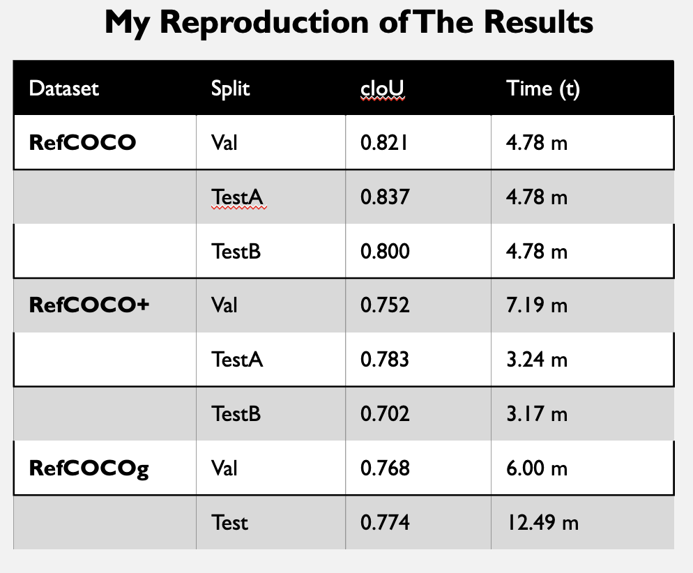
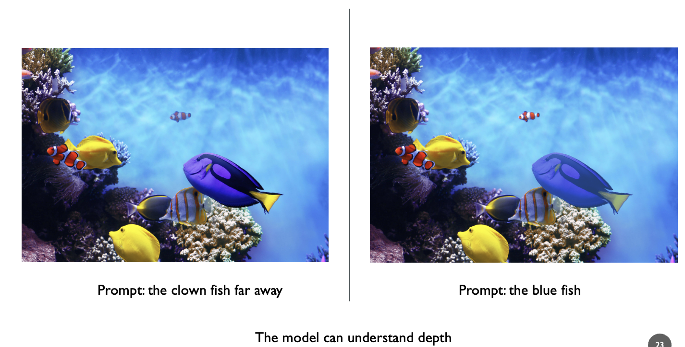
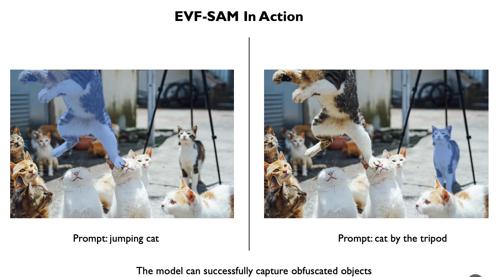

**This is my reproduction of the results from https://github.com/hustvl/EVF-SAM**

## **Abstract:**

This paper presents EVF-SAM, a state-of-the-art model designed for referring expression segmentation and  by leveraging multimodal prompts that combine text and image information. EVF-SAM integrates powerful vision-language models like BEIT-3 with the Segment Anything Model (SAM) to achieve superior segmentation accuracy. Despite its innovative architecture, it shows robust generalization across challenging RES benchmarks and this sets new standards for multimodal segmentation tasks. This paper  highlights the potential of combining foundational vision and language models for real-world applications.

---

# Results

My reproduction of the results on RefCOCO, RefCOCO+, and RefCOCOog which were close to the results in paper.

I used a single GPU node from UTSA's ARC HPC.

The results show that despite being lightweight, EVF-SAM has a great performance compared to other SOTA models in RES.

## Some of my visual experiments with EVF-SAM

The model can understand depth very well

The model can capture obfuscated images successfully

