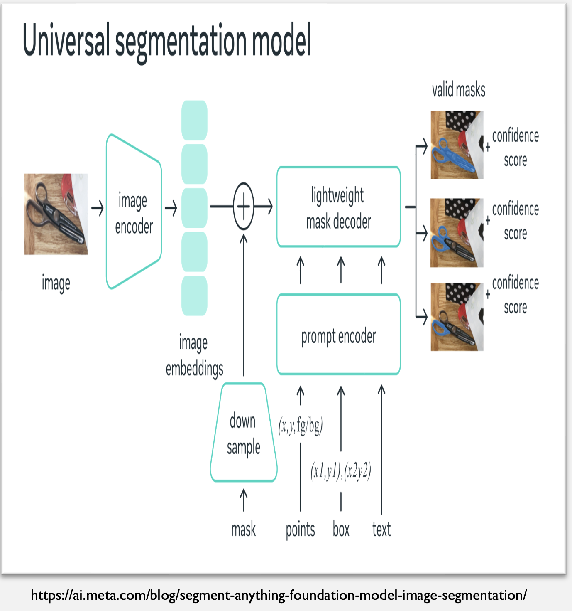
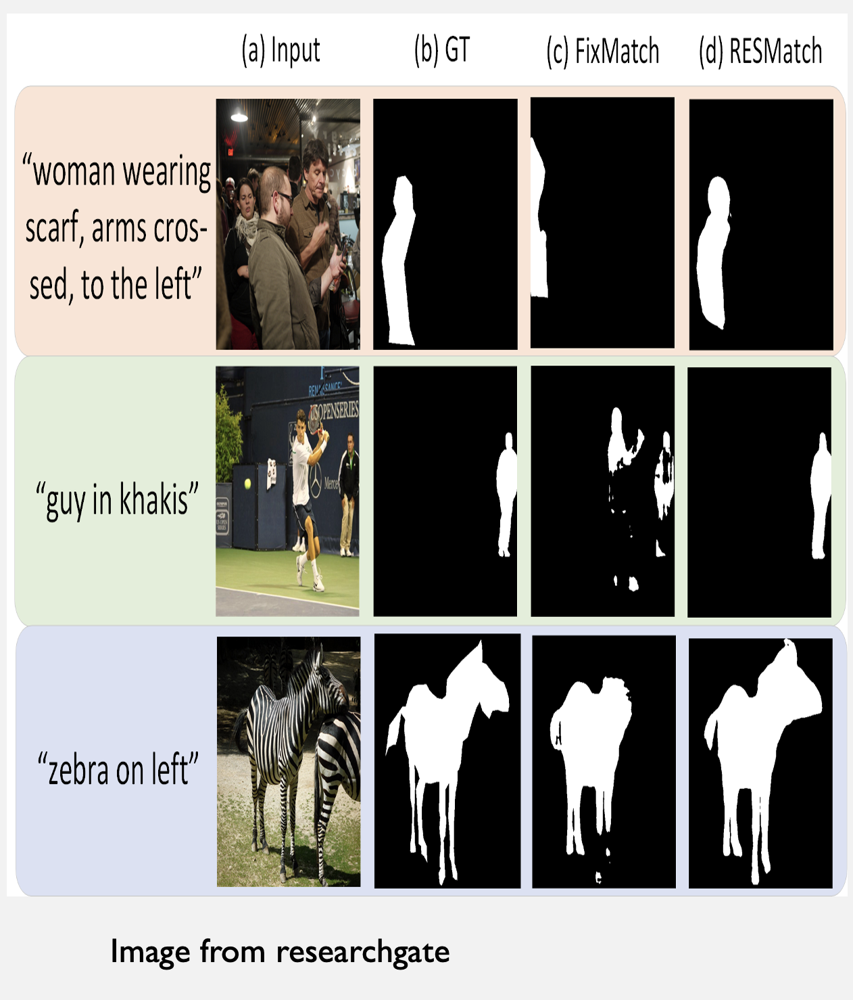
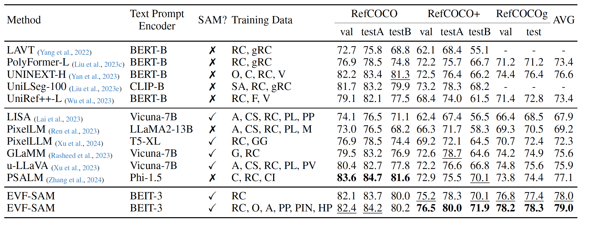

**This is my reproduction of the results from https://github.com/hustvl/EVF-SAM**

EVF-SAM demo on HuggingFace: https://huggingface.co/spaces/wondervictor/evf-sam

## **Abstract:**

This paper presents EVF-SAM, a state-of-the-art model designed for referring expression segmentation and  by leveraging multimodal prompts that combine text and image information. EVF-SAM integrates powerful vision-language models like BEIT-3 with the Segment Anything Model (SAM) to achieve superior segmentation accuracy. Despite its innovative architecture, it shows robust generalization across challenging RES benchmarks and this sets new standards for multimodal segmentation tasks. This paper  highlights the potential of combining foundational vision and language models for real-world applications.


---
**What is SAM?**

The Segment Anything Model, or SAM, is a foundational tool for interactive image segmentation. It lets users generate accurate segmentation masks for objects using geometric prompts such as points and boxes.




**What is Referring Expression Segmentation?**

RES is a task where a text description is used to identify and segment a specific object in an image.





---
# Results

My reproduction of the results on RefCOCO, RefCOCO+, and RefCOCOog which were close to the results in paper.

I used a single GPU node from UTSA's ARC HPC.

My inference setup:

```
>   --version YxZhang/evf-sam \
>   --precision 'fp16' \
>   --vis_save_path "/EVF-SAM/output" \
>   --model_type "ori" \
>   --image_path "/fish.jpg" \
>   --prompt "the clown fish far away" 
```

My training setup:

```
torchrun --standalone --nproc_per_node 2 eval.py   \
    --version YxZhang/evf-sam \
    --dataset_dir /data   \
    --val_dataset "refcoco|unc|val" \
    --model_type ori
```

In all setups I used the original EVF-SAM model which was the same as the one in the paper. Other options are the efficient type and SAM2.

The results show that despite being lightweight, EVF-SAM has a great performance compared to other SOTA models on the task of Referring Expression 
 Segmentation.

Results from the paper:




## Some of my inference experiments with EVF-SAM


The model can understand depth very well


The model can capture obfuscated images successfully


